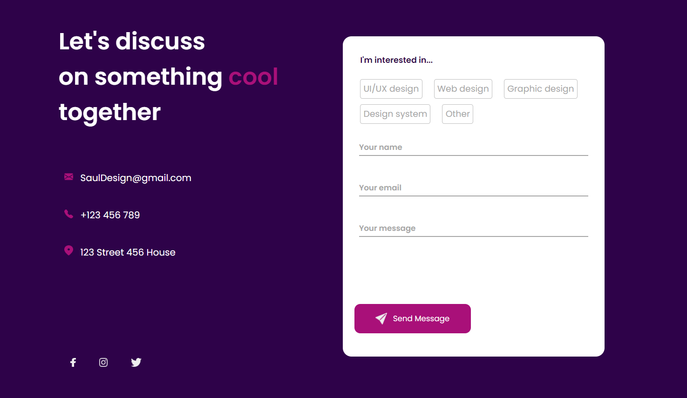
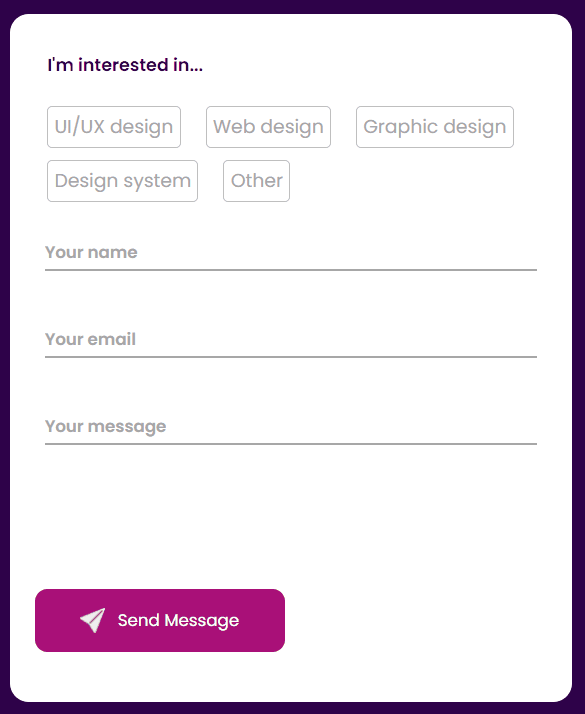

# Project Form with validation

## About the project 📌
### This project is a site  where the user can contact a professional in the design area. With form with validation fields. 

## Overview 💻

- With active states 

- form validation
  

## Links 
- Live Site URL :

## My process 🚀
### Built with 
- Semantic HTML5 markup
- CSS custom properties
- JavaScript

### What I learned 📚
With this project I was able to deepen and practice even more JavaScpit

## Contact 
- LinkedIn : www.linkedin.com/in/larissa-fiali 
